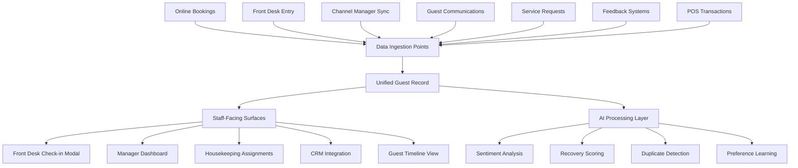

# Guest Intelligence Design Documentation
## Senior Product Design Deliverables for Hotel PMS Platform

---

## 1. Information Architecture

### Data Flow Architecture



### Data Ingestion & Processing Flow

**Primary Sources:**
- **PMS Bookings**: Direct and OTA reservations
- **Channel Manager**: Rate/availability syncs across platforms
- **Guest Communications**: Email, SMS, chat interactions
- **Service Requests**: Housekeeping, maintenance, concierge
- **Feedback Systems**: NPS surveys, online reviews, direct feedback
- **POS Systems**: Restaurant, spa, room service purchases
- **Mobile Apps**: Guest preferences and behavior data

**AI Processing Pipeline:**
1. **Data Normalization**: Standardize formats across all sources
2. **Duplicate Detection**: Merge guest records from multiple channels
3. **Sentiment Analysis**: Process all text-based communications
4. **Preference Extraction**: Learn patterns from guest behavior
5. **Recovery Scoring**: Calculate guest satisfaction recovery probability

---

## 2. Wireframes & Interface Design

### A. Guest Intelligence Dashboard (Manager View)

**Layout Structure:**
```
[Header with Search & Filters]
[Key Insights Cards Row - 4 metrics]
[Tabbed Interface]
├── Guest Profiles (searchable list)
├── AI Insights (sentiment analysis results)
├── Activity Timeline (chronological view)
└── Privacy & Compliance (GDPR status)
```

**Key Features:**
- **Smart Search**: Real-time filtering by name, email, VIP status
- **Status Indicators**: Visual badges for VIP level, open complaints, recovery scores
- **Quick Actions**: One-click profile access, complaint resolution
- **Data Export**: GDPR-compliant guest data portability

### B. Check-in Modal (Agent View)

**Priority Layout:**
```
[Guest Summary Card]
├── Photo + Name + VIP Status
├── Room Assignment + Duration
├── Key Preferences (max 3)
└── Recovery Alert (if applicable)

[AI Insights Section - Max 3 Items]
├── High Priority Actions
├── Medium Priority Suggestions  
└── Low Priority Notes

[Quick Actions Footer]
```

**Interaction Principles:**
- **3-Second Rule**: All critical info visible within 3 seconds
- **One-Click Actions**: Complete, dismiss, or escalate suggestions
- **Progressive Disclosure**: Detailed info available on demand
- **Mobile-First**: Optimized for tablet check-in systems

### C. Guest Timeline with Complaint Threading

**Timeline Structure:**
```
[Date/Time Stamp]
[Event Type Icon] [Event Title] [Status Badge]
[Event Description]
[Expandable Details Section]
├── Resolution Details (if complaint)
├── Staff Notes
├── Related Documents
└── Follow-up Actions
```

**Complaint Resolution Flow:**
1. **Complaint Logged**: Auto-tagged by severity (Critical/Moderate/Low)
2. **SLA Tracking**: Color-coded badges (Green: On-time, Yellow: At-risk, Red: Overdue)
3. **Resolution**: One-click "Mark Resolved" with mandatory note
4. **Audit Trail**: Complete history of actions and staff involved

---

## 3. Interaction Specifications

### Micro-copy & Labels

**Guest Profile Status Indicators:**
- VIP Levels: "Platinum" (gold badge), "Gold" (silver badge), "Silver" (bronze badge)
- Complaint Status: "Open Issue" (red, pulsing), "Resolved" (green), "In Progress" (yellow)
- Recovery Score: "Needs Attention" (<70), "Good Standing" (70-85), "Excellent" (>85)

**Check-in Modal Actions:**
- Primary CTA: "Complete Action" (blue button)
- Secondary: "Dismiss" (outline button)
- Destructive: "Escalate Issue" (red button for critical problems)

**Form Field Labels:**
- Search: "Search guests by name or email..."
- Filter: "Filter by status" (All Guests, VIP Members, Active Complaints)
- Date Range: "Activity from [date] to [date]"

### Error States & Validation

**Data Loading States:**
- Skeleton screens for profile cards while loading
- "No guests found" with suggested filters
- "Connection error" with retry button

**Privacy Compliance Alerts:**
- "Guest consent required for marketing communications"
- "Data retention: 7 years from last stay"
- "Right to deletion: Guest requested data removal"

### Privacy Notices & Consent

**GDPR Compliance Copy:**
```
"We collect and process guest data to personalize your experience and improve our services. 
This includes booking history, preferences, and feedback. You can request access, 
correction, or deletion of your data at any time."
```

**Opt-in Language:**
```
"☐ I consent to personalized service recommendations based on my stay history
☐ I agree to receive relevant offers and updates via email
☐ I allow data sharing with trusted partners for enhanced experiences"
```

---

## 4. AI-Powered Behaviors

### Sentiment Analysis Engine

**Automatic Classification:**
- **Critical Complaints**: Keywords like "disgusting," "terrible," "worst," "unacceptable"
- **Moderate Issues**: "disappointed," "expected better," "could improve"
- **Positive Feedback**: "excellent," "amazing," "exceeded expectations"
- **Neutral**: General comments without emotional indicators

**Real-time Processing:**
- Email/chat messages analyzed within 30 seconds
- Phone call transcripts processed via speech-to-text
- Review platform monitoring (TripAdvisor, Google, etc.)
- Social media mention tracking

### Recovery Predictor Algorithm

**Scoring Factors (0-100 scale):**
- Complaint Severity: Critical (-30), Moderate (-15), Low (-5)
- Resolution Speed: Same day (+20), Next day (+10), >48hrs (-10)
- Guest Value: Platinum (+15), Gold (+10), Silver (+5)
- Historical Satisfaction: Previous NPS 9-10 (+10), 7-8 (+5), <7 (-5)

**Automated Suggestions:**
- Score <70: "Offer complimentary amenity + personal apology"
- Score 70-85: "Acknowledge issue + follow-up call"
- Score >85: "Standard resolution + note in profile"

### Duplicate Detection & Merging

**Matching Criteria:**
1. **Exact Match**: Email address or phone number
2. **Fuzzy Match**: Name similarity + date proximity (90% confidence)
3. **Behavioral Match**: Same credit card + similar booking patterns

**Auto-merge Conditions:**
- Same email across OTA and direct bookings
- Phone number match with <5% name variation
- Credit card fingerprint + arrival date match

**Manual Review Queue:**
- Names with 70-89% similarity
- Different emails but same phone
- Corporate vs. personal bookings for same individual

---

## 5. Visual Style Guidance

### Color Psychology & Meaning

**Primary Palette:**
- **Trust Blue** (#3B82F6): Primary actions, VIP status, completion states
- **Warm Green** (#10B981): Positive feedback, resolved issues, success
- **Alert Orange** (#F59E0B): Moderate issues, pending actions, warnings
- **Critical Red** (#EF4444): Urgent complaints, overdue items, errors

**Background Tones:**
- **Soft Gray** (#F8FAFC): Main background, neutral spaces
- **Warm White** (#FEFEFE): Card backgrounds, content areas
- **Subtle Blue** (#F0F9FF): VIP member highlighting
- **Gentle Green** (#F0FDF4): Resolved complaint backgrounds

### Typography Hierarchy

**Font Stack:** Inter (primary), system fonts (fallback)

**Hierarchy:**
- **H1 (32px/40px)**: Page titles, guest names in profiles
- **H2 (24px/32px)**: Section headers, card titles
- **H3 (18px/24px)**: Subsection headers, insight categories
- **Body (16px/24px)**: Main content, descriptions
- **Small (14px/20px)**: Metadata, timestamps, secondary info
- **Caption (12px/16px)**: Form labels, helper text

### Spacing & Layout

**Grid System:** 8px base unit for consistent spacing
- **Micro spacing**: 4px (inline elements)
- **Small spacing**: 8px (related items)
- **Medium spacing**: 16px (component groups)
- **Large spacing**: 24px (sections)
- **XL spacing**: 32px (major layout areas)

### Animation & Interaction

**Transition Principles:**
- **Duration**: 200ms for micro-interactions, 300ms for page transitions
- **Easing**: ease-out for entrances, ease-in for exits
- **Progressive Enhancement**: Animations enhance but don't block functionality

**Specific Animations:**
- **Loading States**: Subtle shimmer effect on skeleton screens
- **Status Changes**: Smooth color transition when complaint marked resolved
- **Hover States**: 0.15s elevation increase on interactive cards
- **Modal Appearance**: 0.2s fade + scale from 95% to 100%

---

## 6. Technical Requirements

### Performance Standards

**Loading Benchmarks:**
- Guest profile: <500ms initial load
- Check-in modal: <200ms popup
- Timeline events: <1s for 50 items
- Search results: <300ms response time

**Accessibility (WCAG 2.1 AA):**
- Color contrast ratio: minimum 4.5:1
- Keyboard navigation: all actions accessible via tab/enter
- Screen reader: semantic HTML and ARIA labels
- Focus indicators: visible outline on all interactive elements

### Mobile Responsiveness

**Breakpoints:**
- Mobile: 320px - 768px (single column layout)
- Tablet: 768px - 1024px (adjusted spacing, touch-friendly)
- Desktop: 1024px+ (full feature set)

**Touch Targets:**
- Minimum 44px height for all buttons
- 8px minimum spacing between adjacent targets
- Swipe gestures for timeline navigation

### Localization Support

**RTL Language Support:**
- Arabic, Hebrew interface adaptation
- Mirrored layouts for right-to-left reading
- Culturally appropriate date/time formats

**Internationalization:**
- Currency display based on hotel location
- Date formats: MM/DD/YYYY (US), DD/MM/YYYY (EU), YYYY-MM-DD (ISO)
- Number formatting: comma vs. period separators
- Time zones: display in hotel local time with guest's time zone option

---

## 7. Compliance & Privacy Architecture

### GDPR Implementation

**Data Minimization:**
- Collect only necessary guest information
- Automatic data anonymization after 7 years
- Granular consent for different data uses

**Guest Rights Management:**
- Self-service data download portal
- One-click consent withdrawal
- Data correction workflow for guest updates

### Security Measures

**Encryption Standards:**
- AES-256 for data at rest
- TLS 1.3 for data in transit
- End-to-end encryption for sensitive communications

**Access Controls:**
- Role-based permissions (Manager, Agent, Housekeeping)
- Activity logging for all profile access
- Two-factor authentication for admin functions

### Audit Trail Requirements

**Logged Actions:**
- Guest profile views (who, when, duration)
- Data modifications (field changes, timestamps)
- Complaint resolutions (staff member, action taken)
- Data exports (compliance requests, business needs)

---

## 8. Success Metrics & KPIs

### Staff Empowerment Metrics

**Efficiency Indicators:**
- Check-in time reduction: Target 25% decrease
- Complaint resolution time: <2 hours for critical issues
- Staff confidence survey: 4.5/5 on "feeling prepared for guest interactions"

### Guest Satisfaction Impact

**Recovery Performance:**
- NPS improvement: +15 points within 6 months
- Repeat booking rate: 10% increase for complaint-recovered guests
- Review sentiment: 20% improvement in online review scores

### Operational Excellence

**System Performance:**
- 99.9% uptime for guest intelligence features
- <1% false positive rate for duplicate detection
- 90% accuracy in sentiment analysis validation

### Compliance Validation

**Privacy Metrics:**
- Zero critical findings in external audits
- 100% staff completion of privacy training
- <24 hour response time for guest data requests

---

## 9. Implementation Roadmap

### Phase 1: Core Platform (Weeks 1-8)
- Guest profile unification
- Basic complaint tracking
- Check-in modal MVP

### Phase 2: AI Enhancement (Weeks 9-16)
- Sentiment analysis integration
- Recovery score algorithm
- Automated suggestions engine

### Phase 3: Advanced Features (Weeks 17-24)
- Timeline visualization
- Advanced analytics dashboard
- Mobile optimization

### Phase 4: Compliance & Polish (Weeks 25-28)
- GDPR compliance verification
- Accessibility audit and fixes
- Performance optimization

---

## 10. Design System Components

### Reusable UI Elements

**Guest Card Component:**
```typescript
interface GuestCardProps {
  guest: GuestProfile
  showActions?: boolean
  compact?: boolean
  onSelect?: (guest: GuestProfile) => void
}
```

**Status Badge System:**
```typescript
type BadgeVariant = 'vip' | 'complaint' | 'recovery' | 'status'
type BadgeSeverity = 'low' | 'medium' | 'high' | 'critical'
```

**Action Button Variants:**
- Primary: Complete actions, main CTAs
- Secondary: View details, secondary actions  
- Warning: Escalate issues, require attention
- Success: Mark resolved, positive confirmations

This comprehensive design system ensures consistent, empathetic, and efficient guest intelligence management while maintaining the highest standards of privacy and compliance. 